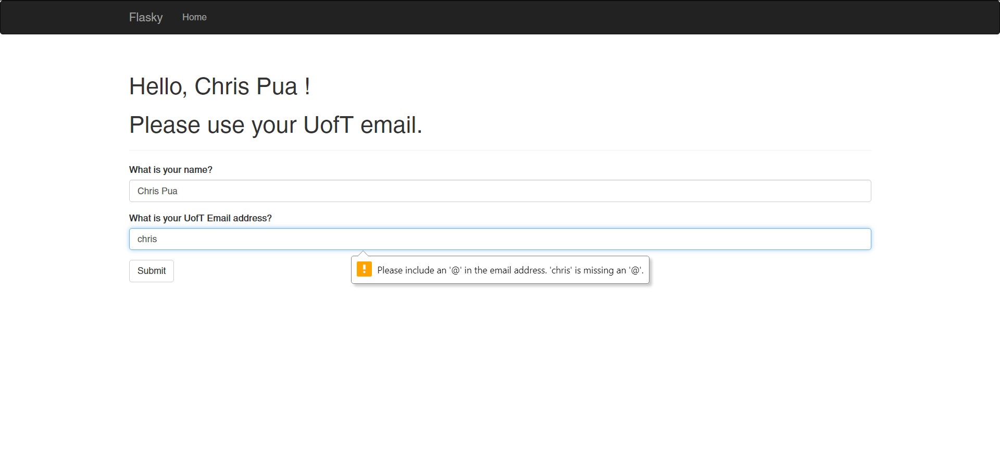
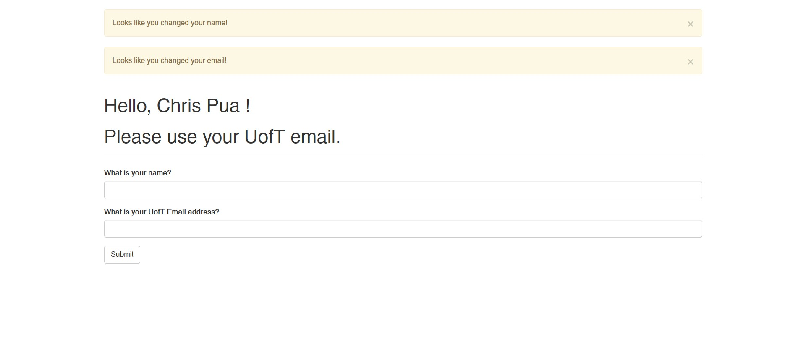

this repo is a clone of https://github.com/miguelgrinberg/flasky

# Activity 1

# Activity 2

# Activity 3

| SQL | NoSQL |
|-----|-------|
|Tables have fixed rows and columns|Contains Documents which are JSON objects, key-value pairs, graphs, and more|
|Schemas are rigid in the sense that they are relational|Schemas are flexible because they are non-relational
|Scales vertically -> larger/more powerful servers|Scales horizontally -> spread out across a number of servers|
|Better for multi-row transactions|Better for unstructured data for flexibility|